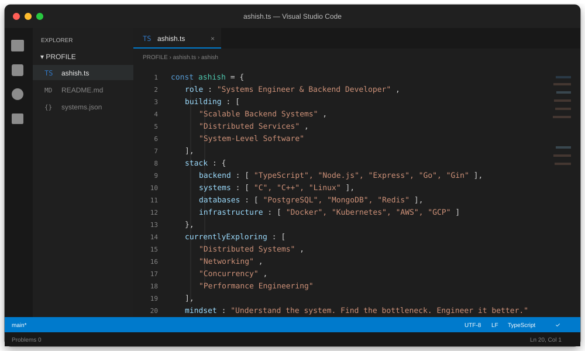

 

  

<h1 align="center">Hi 👋 I Am Ashish Chaurasia</h1>

  

<h3 align="center">Systems Engineer & Backend Developer</h3>

  

  
  

  

  

  
  
  
  
  
  
  
  
  
  
  
  
  
  
  
  
  
  
  
  
  
  
  
  
  
  
  
  
  
  
  
  

<picture>
  <source media="(prefers-color-scheme: dark)" srcset="https://raw.githubusercontent.com/drdead0/drdead0/output/pacman-contribution-graph-dark.svg" />
  <source media="(prefers-color-scheme: light)" srcset="https://raw.githubusercontent.com/drdead0/drdead0/output/pacman-contribution-graph.svg" />
  
</picture>

  

